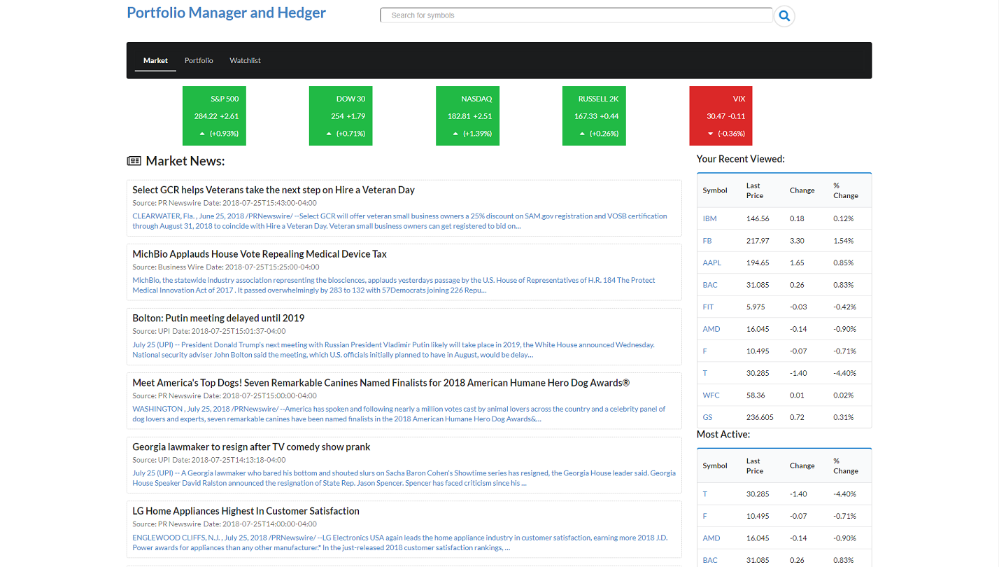
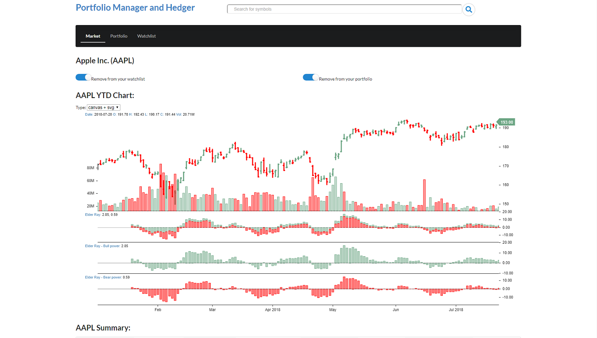
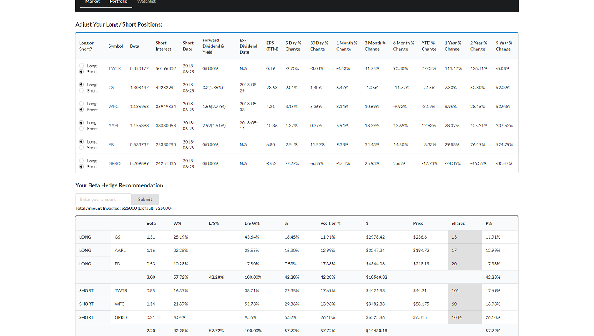
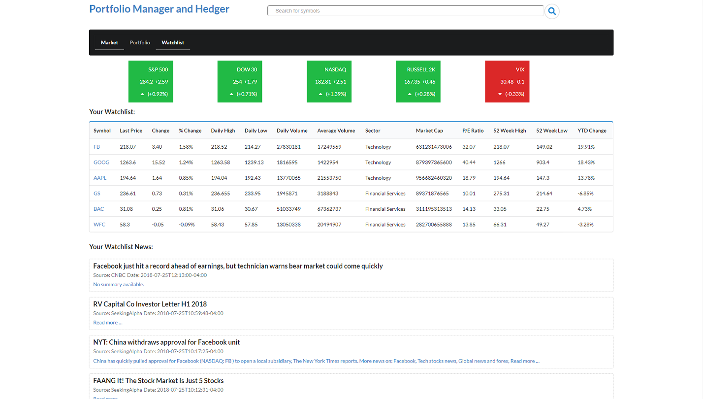

## Portfolio Manager and Hedger (front-end)
Portfolio Manager and Hedger is a financial web app that provides investment advice based on dynamic hedging algorithm, as well as real-time stock news, quotes, charts and watchlist monitoring including recent viewed, most active, gainers and losers. This is the front-end, it requires [Portfolio Database](https://github.com/rainANDshine/portfolio-database) to run.

## Technical Aspects
+ Created hedging algorithm to provide investment guidance dynamically based on addition / deletion and long / short of positions
+ Set multiple fetches in interval to pull and update data in real-time from external APIs
+ Created front-end application using React
+ Built back-end JSON API server with full CRUD functions using Ruby on Rails
+ Implemented Semantic UI React and custom CSS to design front-end

## Latest Stable Branch
Master

## Installation
1. git clone https://github.com/rainANDshine/portfolio-manager

2. npm install && npm start

## Youtube Video Demo
https://www.youtube.com/watch?v=4jI4vCN9ws0&t=7s

## Screenshots

## Credits
Solo full-stack project built by [Shun Yao](https://github.com/rainANDshine)

## License
MIT ©
